# 设计模式学习总结

## 1. Iterator模式

- Iterator模式的类图：

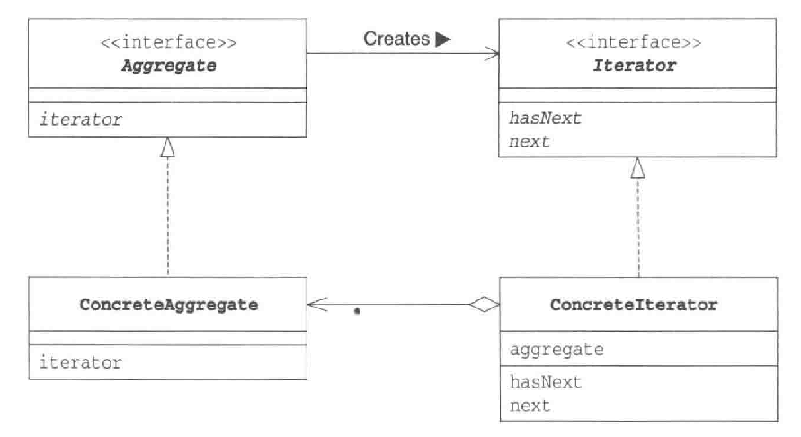

- [sample code](./code/Iterator/)

## 2. Adapter模式

- 类适配器模式的类图（使用继承）：

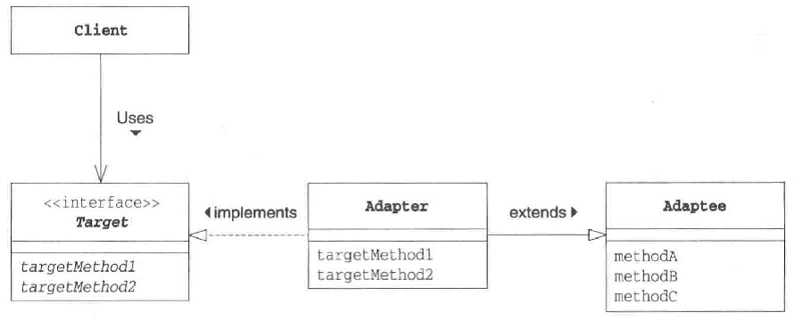

- 对象适配器模式（使用委托）：

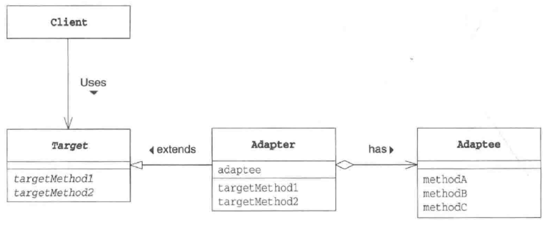

- [sample code](./code/Adapter/)

## 3. Template method模式

- Template method模式的类图：

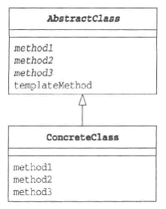

- [sample code](./code/TemplateMethod/)

## 4. Factory method

- factory method模式的类图：

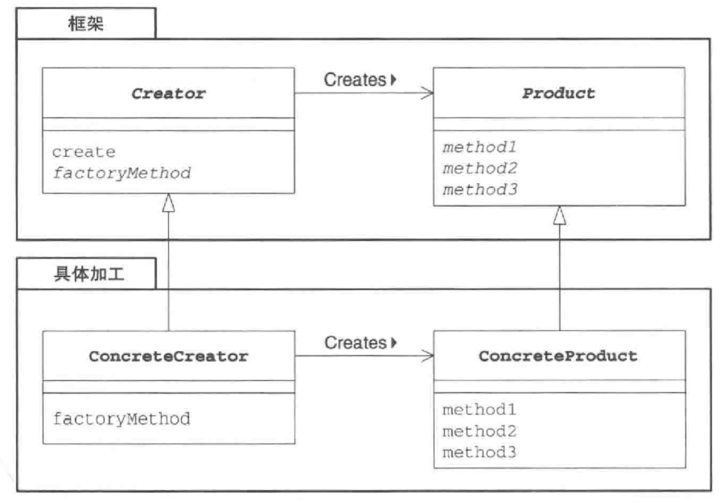

- [sample code](./code/FactoryMethod/)

## 5. Singleton模式

- Singleton模式的类图：

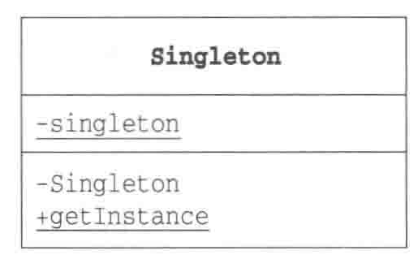

- [sample code](./code/Singleton/)

## 6.Prototype模式

通过复制生成实例

- prototype模式的类图：

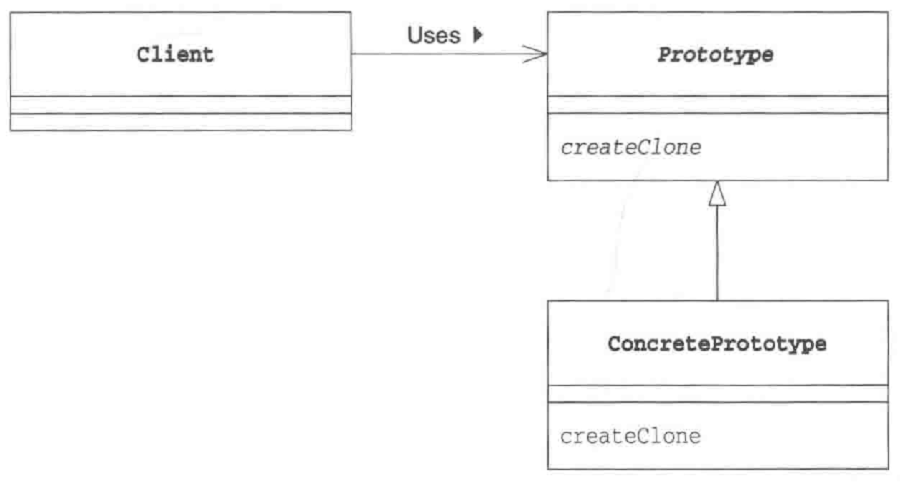

- [sample code](./code/Prototype/)

## 7.Builder模式

组装复杂的实例

- Builder模式类图：

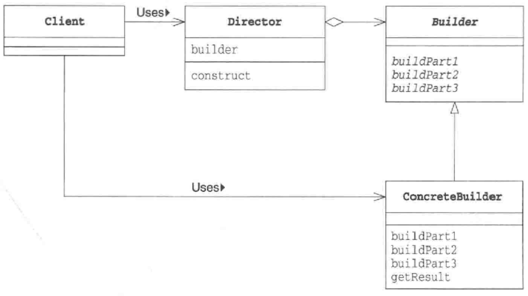

- builder模式的时序图：

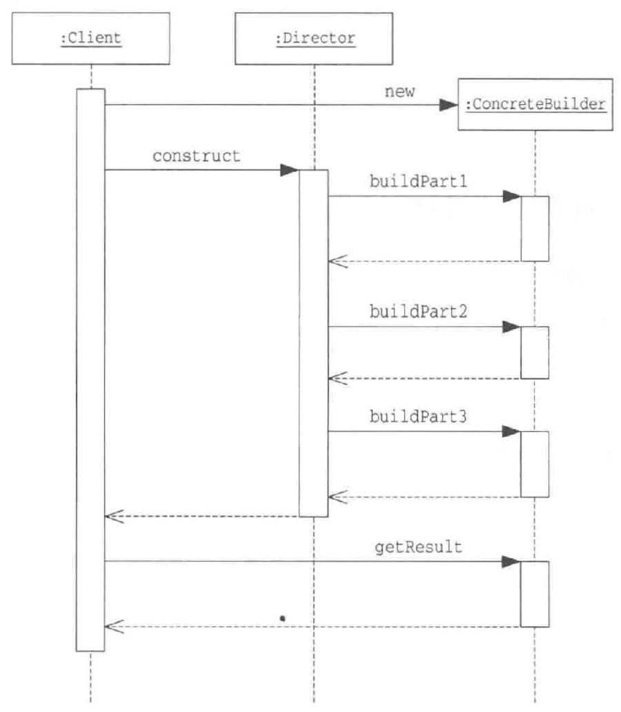

- [sample code](./code/Builder/)

## 8.Abstract Factory 模式

将关联零件组装成产品

- Abstract Factory模式的类图：

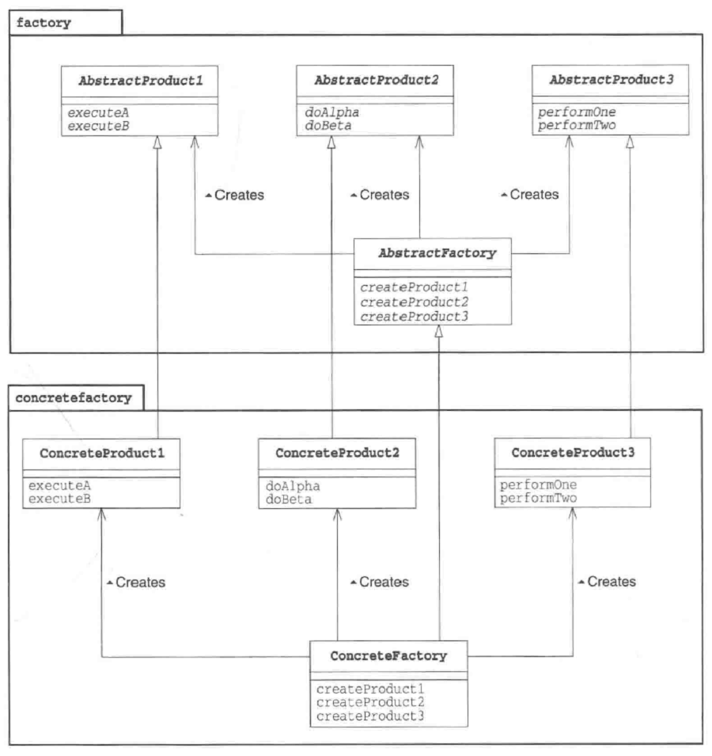

- [sample code](./code/AbstractFactory/)

## 9.Bridge 模式

将类的功能层次结构与实现层次结构分离

- Bridge模式的类图：

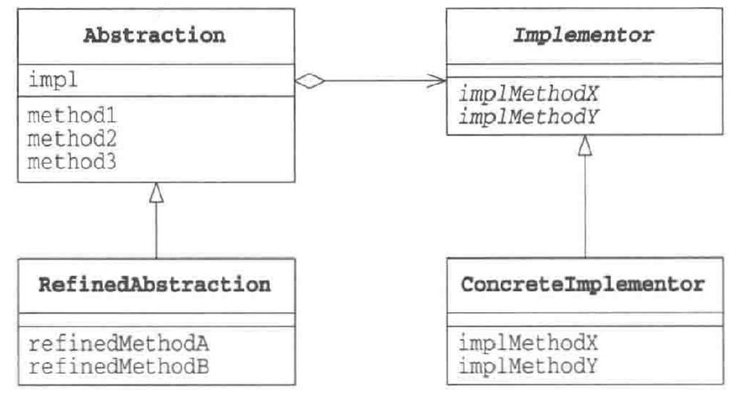

- [sample code](./code/Bridge/)

## 10.Strategy 模式

整体的替换算法

- Strategy模式的类图：

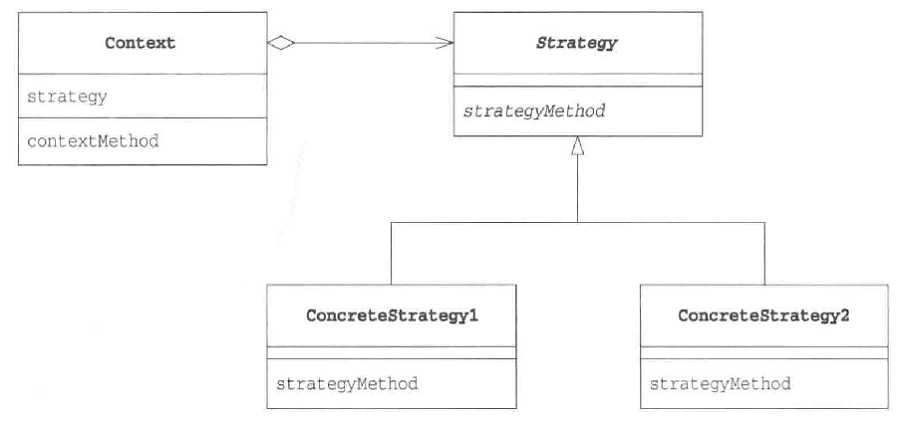

- [sample code](./code/Strategy/)

****

## 11. Composite 模式

容器与内容的一致性，递归模式。

- composite模式的类图

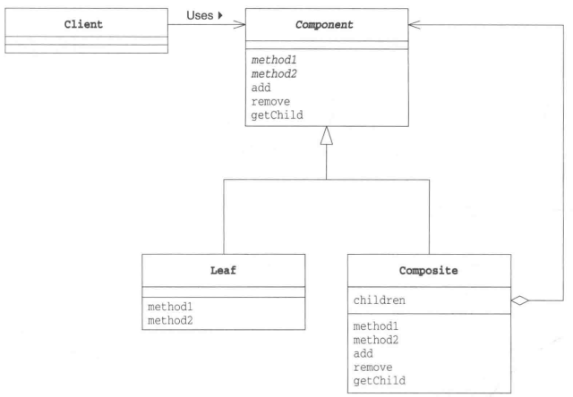

- [sample code](./code/Composite/)

## 12. Decorator 模式

装饰边框与被装饰物的一致性

- Decorator 模式的类图

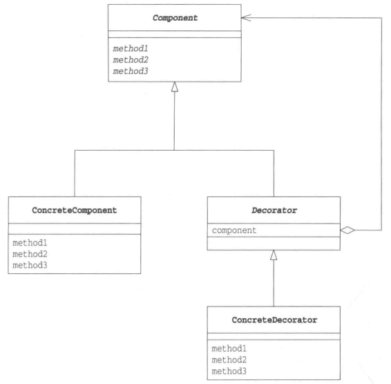

- [sample code](./code/Decorator/)

## 13. Visitor 模式

访问数据结构并处理数据，数据结构与处理被分离出来。

- Visitor 模式的类图

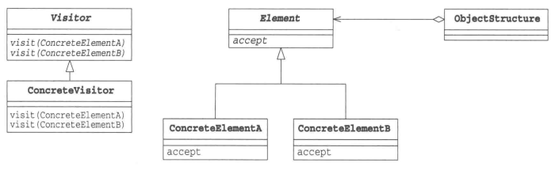

- [sample code](./code/Visitor/)

## 14. Chain of Responsibility 模式

推卸责任，责任链。

- chain of responsibility 模式的类图

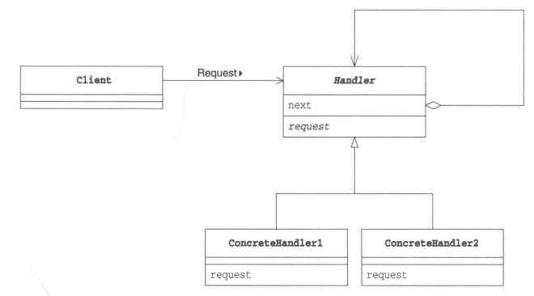

- [sample code](./code/ChainOfResponsibility/)

## 15. Facade 模式

简单窗口，为互相关联在一起错综复杂的类整理出高层接口。

- facade 模式的类图

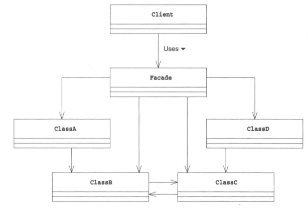

- [sample code](./code/Facade/)

## 16. Mediator 模式

只有一个仲裁者，组员向仲裁者报告，仲裁者向组员下达指示。

- Mediator 模式的类图

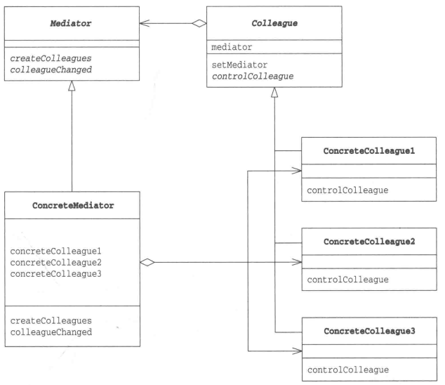

- [sample code](./code/Mediator/)

## 17. Observer 模式

发送状态变化通知，适用于根据对象状态进行相应处理的场景。

- Observer 模式的类图

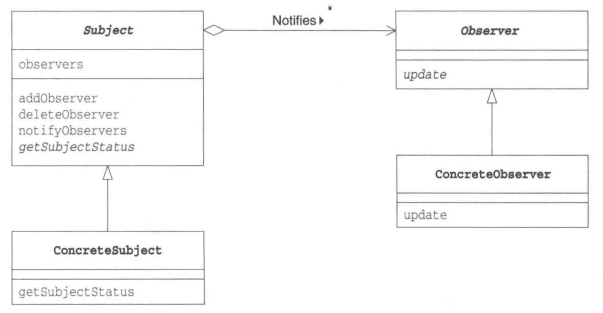

- [sample code](./code/Observer/)

## 18. Memento 模式

保存对象状态

- Memento 模式的类图

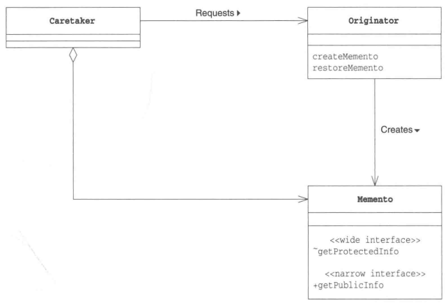

- [sample code](./code/Memento/)

## 19. State 模式

用类表示状态

- State 模式的类图

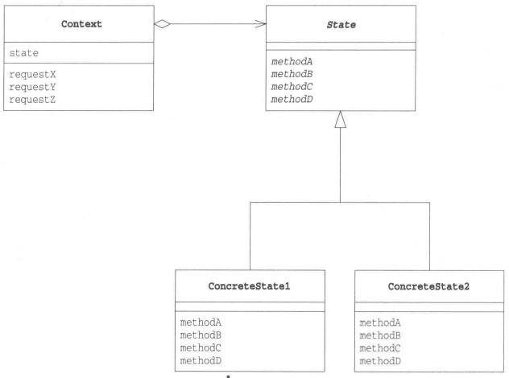

- [sample code](./code/State/)

## 20. Flyweight 模式

共享对象，避免浪费。通过尽量共享实例来避免new出实例。

- Flyweight 模式的类图

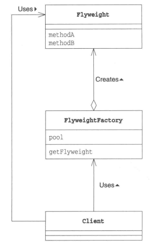

- [sample code](./code/Flyweight/)

## 21. Proxy 模式

只在必要时生成实例。

- Proxy 模式的类图

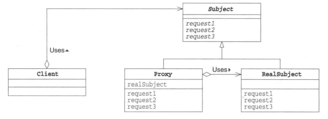

- [sample code](./code/Proxy/)

## 22. Command 模式

命令也是类

- Command模式的类图

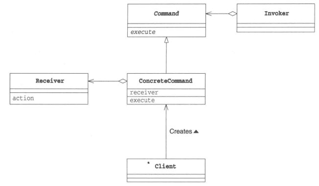

- [sample code](./code/Command/)

## 23. Interpreter 模式

语法规则也是类。

- Interpreter 模式的类图

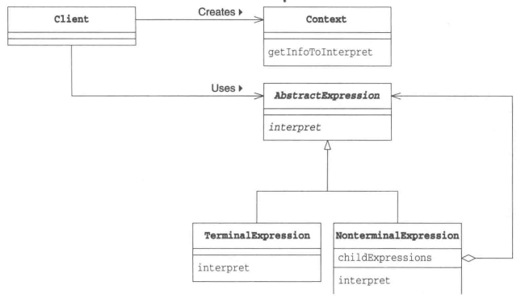

- [sample code](./code/Interpreter/)

