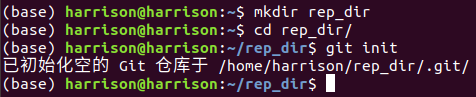

# Basic Git operations  

## 1. 环境安装

Linux系统下执行：`sudo apt-get install git`　　

Windows: Git官网直接[下载安装程序](https://git-scm.com/downloads)。

安装完成后，还需要最后一步设置，在命令行输入：

```bash
git config --global user.name "Your Name"
git config --global user.email "email@example.com"
```

-----

## 2. 创建项目仓库

首先，选择一个合适的地方，创建一个空目录：

```bash
mkdir [rep_dir]
cd [rep_dir]
```

然后通过`git init`命令把这个目录变成Git可以管理的仓库

```bash
git init
```



## 3. 时光机穿梭

### 3.1 版本回退

- `HEAD`指向的版本是当前版本，因此，Git允许我们在版本的历史之间穿梭，使用命令`git reset --hard commit_id`。
- 穿梭前，用`git log`可以查看提交历史，以便确定要回退到哪个版本。
- 要重返未来，用`git reflog`查看命令历史，以便确定要回到未来的哪个版本。

### 3.2 工作区和暂存区

- 第一步是用`git add`把文件添加进去，实际上就是把文件修改添加到暂存区；

- 第二步是用`git commit`提交更改，实际上就是把暂存区的所有内容提交到当前分支；

- 第三步是用git push上传至远程库。

  

  需要提交的文件修改通通放到暂存区，然后，一次性提交暂存区的所有修改。

### 3.3 管理修改

第一步是用`git status`查看当前工作区是否同仓库一致(团队协作时，可能别人有新的提交内容)；

第二步是用`git pull`拉取新增修改；

第三步是用`git add [文件名]`将修改放进暂存区；

第四步是用`git commit`讲将暂存区内容放进分支；

第五步是用`git push`上传到远程库；

### 3.4 撤销修改

`git checkout -- file`可以丢弃工作区的修改;

`git reset HEAD <file> `可以把暂存区的修改撤销掉;

`git reset --hard commit_id`可以回到不同的版本库。

### 3.5 删除文件

工作区删除文件：`rm [file]`

这个时候，Git知道删除了文件，因此，工作区和版本库就不一致了,`git status`命令会显示哪些文件被删除了。

现在有两个选择，一是确实要从版本库中删除该文件，用命令`git rm`删掉，并且`git commit`；

二是删错了，`git checkout -- <file>`，因为版本库里还有呢，所以可以很轻松地把误删的文件恢复到版本库里的文件内容。

## 4 远程仓库

本地Git仓库和GitHub仓库之间的传输是通过SSH加密的，所以，需要一点设置：

- 创建SSH Key

  在用户主目录下，看看有没有.ssh目录，如果有，再看看这个目录下有没有`id_rsa`和`id_rsa.pub`这两个文件，如果已经有了，可直接跳到下一步。如果没有，打开Shell

  ```bash
  ssh-keygen -t rsa -C "youremail@example.com"
  ```

- 登陆GitHub，打开“Account settings”，“SSH Keys”页面

  然后，点“Add SSH Key”，填上任意Title，在Key文本框里粘贴`id_rsa.pub`文件的内容：

  

  点“Add Key”，你就应该看到已经添加的Key：

  

### 4.1 添加仓库

在github上创建一个仓库，然后利用如下命令关联远程仓库：

```bash
git remote add origin git@github.com:用户名/仓库名.git
```

下一步，就可以把本地库的所有内容推送到远程库上：

```bash
git push -u origin master
```

由于远程库是空的，我们第一次推送`master`分支时，加上了`-u`参数，Git不但会把本地的`master`分支内容推送的远程新的`master`分支，还会把本地的`master`分支和远程的`master`分支关联起来，在以后的推送或者拉取时就可以简化命令。

此后，每次本地提交后，只要有必要，就可以使用如下命令推送最新修改；

```bash
git push origin master
```

### 4.2 从远程库克隆

```bash
git clone 远程仓库地址
```

## 5. 分支管理

### 5.1 创建与合并分支

查看分支：`git branch`

创建分支：`git branch <name>`

切换分支：`git checkout <name>`或者`git switch  <name>`

创建+切换分支：`git checkout -b  <name>`或者`git switch -c  <name>`

合并某分支到当前分支：`git merge <name> `

删除分支：`git branch -d <name> `

### 5.2 解决冲突

- 当Git无法自动合并分支时，就必须首先解决冲突。解决冲突后，再提交，合并完成。
- 解决冲突就是把Git合并失败的文件手动编辑为我们希望的内容，再提交。
- 用`git log --graph`命令可以看到分支合并图。

### 5.3 分支管理策略

​		合并分支时，加上`--no-ff`参数就可以用普通模式合并，合并后的历史有分支，能看出来曾经做过合并，而`fast forward`合并就看不出来曾经做过合并。

​		在实际开发中，我们应该按照几个基本原则进行分支管理：首先，`master`分支应该是非常稳定的，也就是仅用来发布新版本，平时不能在上面干活；那在哪干活呢？干活都在`dev`分支上，也就是说，`dev`分支是不稳定的，到某个时候，比如1.0版本发布时，再把`dev`分支合并到`master`上，在`master`分支发布1.0版本；你和你的小伙伴们每个人都在`dev`分支上干活，每个人都有自己的分支，时不时地往`dev`分支上合并就可以了。所以，团队合作的分支看起来就像这样：


### 5.4 Bug分支

- 修复bug时，我们会通过创建新的bug分支进行修复，然后合并，最后删除；

- 当手头工作没有完成时，先把工作现场`git stash`一下，然后去修复bug，修复后，再`git stash pop`，回到工作现场；

- 在master分支上修复的bug，想要合并到当前dev分支，可以用`git cherry-pick `命令，把bug提交的修改“复制”到当前分支，避免重复劳动。

### 5.5 feature分支

- 开发一个新feature，最好新建一个分支；

- 如果要丢弃一个没有被合并过的分支，可以通过`git branch -D `强行删除。

### 5.6 多人协作

- 查看远程库信息，使用`git remote -v`；
- 本地新建的分支如果不推送到远程，对其他人就是不可见的；
- 从本地推送分支，使用`git push origin branch-name`，如果推送失败，先用`git pull`抓取远程的新提交；
- 在本地创建和远程分支对应的分支，使用`git checkout -b branch-name origin/branch-name`，本地和远程分支的名称最好一致；
- 建立本地分支和远程分支的关联，使用`git branch --set-upstream branch-name origin/branch-name`；
- 从远程抓取分支，使用`git pull`，如果有冲突，要先处理冲突。

### 5.7 rebase

- rebase操作可以把本地未push的分叉提交历史整理成直线；
- rebase的目的是使得我们在查看历史提交的变化时更容易，因为分叉的提交需要三方对比。

## 6. 标签管理

tag就是一个让人容易记住的有意义的名字，它跟某个commit绑在一起。

### 6.1 创建标签

- 命令`git tag `用于新建一个标签，默认为`HEAD`，也可以指定一个commit id；
- 命令`git tag -a  -m "blablabla..."`可以指定标签信息；
- 命令`git tag`可以查看所有标签。

### 6.2 操作标签

- 命令`git push origin `可以推送一个本地标签；
- 命令`git push origin --tags`可以推送全部未推送过的本地标签；
- 命令`git tag -d `可以删除一个本地标签；
- 命令`git push origin :refs/tags/`可以删除一个远程标签。

## 7. 使用Github

- 在GitHub上，可以任意Fork开源仓库；
- 自己拥有Fork后的仓库的读写权限；
- 可以推送pull request给官方仓库来贡献代码。

