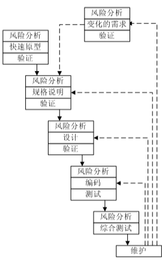

# 枚举3-4中软件开发流程（假设你是团队项目负责人，你最中意的是那种？为什么）

## 1. 瀑布模型

### 1.1 模型概述

​		 瀑布模型是一个经典的软件生命周期模型，也叫预测型生命周期、完全计划驱动型生命周期。在这个模型里，在项目生命周期的尽早时间，要确定项目范围及交付此范围所需的时间和成本。采用这个模型的话，一般将软件开发分为可行性分析（计划）、需求分析、软件设计（概要设计、详细设计）、编码（含单元测试）、测试、运行维护等几个阶段，如下图所示

### 1.2 模型特点

  瀑布模型中每项开发活动具有以下特点：

  - 从上一项开发活动接受其成果作为本次活动的输入;
  - 利用这一输入，实施本次活动应完成的工作内容;
  - 给出本次活动的工作成果，作为输出传给下一项开发活动;
  - 对本次活动的实施工作成果进行评审。若其工作成果得到确认，则继续进行下一项开发活动；否则返回前一项，甚至更前项的活动。尽量减少多个阶段间的反复。以相对来说较小的费用来开发软件。

### 1.3 优缺点分析

​		 **优点**：有利于大型软件开发过程中人员的组织、管理，有利于软件开发方法和工具的研究，从而提高了大型软件项目开发的质量和效率。

​		  **缺点**：开发过程一般不能逆转，否则代价太大；很难严格按该模型进行；很难清楚地给出所有的需求。

### 1.4 模型适用范围

​		 用户的需求非常清楚全面，且在开发过程中没有或很少变化,对软件的应用领域很熟悉；用户的使用环境非常稳定；开发工作对用户参与的要求很低。

-----

## 2. 快速原型

### 2.1 模型简介

​		 快速原型模型又称原型模型，它是在开发真实系统之前，构造一个原型，在该原型的基础上，逐渐完成整个系统的开发工作。由于种种原因，在需求分析阶段得到完全、一致、准确、合理的需求说明是很困难的，在获得一组基本需求说明后，就快速地使其“实现”，通过原型反馈，加深对系统的理解，并满足用户基本要求，使用户在试用过程中受到启发，对需求说明进行补充和精确化，消除不协调的系统需求，逐步确定各种需求，从而获得合理、协调一致、无歧义的、完整的、现实可行的需求说明。其流程如下图所示：  

### 2.2 模型特点

- 快速分析，构造原型，运行原型，评价原型，修改原型；
- 快速原型模型需要迅速建造一个可以运行的软件原型 ，以便理解和澄清问题，使开发人员与用户达成共识，最终在确定的客户需求基础上开发客户满意的软件产品。

### 2.3 优缺点分析

​			**优点**：克服瀑布模型的缺点，减少由于软件需求不明确带来的开发风险；在结构上看，快速原型模型是不带反馈环的，使得采用这种模型的软件产品的开发基本上是线性顺序的。只有在产品发布运行之后才需要再来维护。

​			**缺点**：所选用的开发技术和工具不一定符合主流的发展；快速建立起来的系统结构加上连续的修改可能会导致产品质量低下。

### 2.4 模型使用范围

​			对所开发的领域比较熟悉而且有快速的原型开发工具，是在需求不明确的情况下常用的一种方法；快速原型技术适用于软件产品要求有大量的用户交互、或者产生大量的可视输出、或设计一些复杂的算法等场合。

-----

## 3. 螺旋模型

### 3.1 模型简介

​			螺旋模型是一种演化软件开发过程模型，它兼顾了快速原型的迭代特征以及瀑布模型的系统化与严格监控。螺旋模型最大的特点在于引入了其他模型不具备的风险分析，使软件在无法排除重大风险时有机会停止，以减小损失。同时，在每个迭代阶段构建原型是螺旋模型用以减小风险的途径。螺旋模型是快速原型模型以进化的开发方式为中心，在每个项目阶段使用瀑布模型法。该模型的每一个周期都包括需求定义、风险分析、工程实现和评审4个阶段，由这4个阶段进行迭代。软件开发过程每迭代一次，软件开发又前进一个层次。用螺旋模型的软件过程如下：

### 3.2 模型特点

​			螺旋模型在“瀑布模型”的每一个开发阶段前引入一个非常严格的风险识别、风险分析和风险控制，它把软件项目分解成一个个小项目。每个小项目都标识一个或多个主要风险，直到所有的主要风险因素都被确定螺旋模型强调风险分析，使得开发人员和用户对每个演化层出现的风险有所了解，继而做出应有的反应，因此特别适用于庞大、复杂并具有高风险的系统

### 3.3 优缺点分析

　**优点**：

- 对可选方案和约束条件的强调有利于已有软件的重用，也有助于把软件质量作为软件开发的一个重要目标；
- 减少了过多测试（浪费资金）或测试不足（产品故障多）所带来的风险；
- 在螺旋模型中维护只是模型的另一个周期，在维护和开发之间并没有本质区别。　

　**缺点**：

- 采用螺旋模型需要具有相当丰富的风险评估经验和专门知识，在风险较大的项目开发中，如果未能够及时标识风险，势必造成重大损失；
- 过多的迭代次数会增加开发成本，延迟提交时间。

### 3.4 模型适用范围

​			对于新近开发，需求不明确的情况下，适合用螺旋模型进行开发，便于风险控制和需求变更。螺旋模型适合于大规模的软件项目。

------

## 4. RUP流程

### 4.1 模型简介

​			Rational统一过程（Rational Unified Process,RUP），它是由Rational软件公司推出的一种完整而且完美的软件过程。它可以作为软件开发的良好开端。RUP类似一个在线的指导者，它可以为所有方面和层次的程序开发提供指导方针，模版以及事例支持。把开发中面向过程的方面（例如定义的阶段，技术和实践）和其他开发的组件（例如文档，模型，手册以及代码等等）整合在一个统一的框架内。其核心概念如下图所示：

### 4.2 模型特点

​			三大特点：

- 软件开发是一个迭代过程;

  RUP强调软件开发是一个迭代模型，它定义了四个阶段：初始、细化、构造、交付。

- 软件开发是由用例驱动的;

  在系统分析和系统设计中，用例被用来将一个复杂的庞大系统分割、定义成一个个小的单元，这个小的单元就是用例。然后以每个小的单元为对象进行开发。

- 软件开发是以架构设计为中心的。

  构架设计是系统设计的一个重要组成部分。在构架设计过程中，设计师必须完成对技术和运行平台的选取，整个项目的基础框架的设计，完成对公共组件的设计，如审计系统、日志系统、错误处理系统、安全系统等。设计师必须对系统的可扩展性、安全性、可维护性、可延拓性、可重用性和运行速度提出可行的解决方案。

### 4.3 优缺点分析

​			优点：提高了团队生产力，在迭代的开发过程、需求管理、基于组件的体系结构、可视化软件建模、验证软件质量及控制软件变更等方面，针对所有关键的开发活动为每个开发成员提供了必要的准则、模板和工具指导，并确保全体成员共享相同的知识基础。它建立了简洁和清晰的过程结构，为开发过程提供较大的通用性。

​			缺点：RUP只是一个开发过程，并没有涵盖软件过程的全部 内容，例如它缺少关于软件运行和支持等方面的内容；此外，它没有支持多项目的开发结构，这在一定程度上降低了在开发组织内大范围实现重用的可能性。

### 4.4 模型适用范围

​			主要适用于大型的需求不断变化的复杂软件系统项目。

-----

## 5 最中意螺旋模型

​		因为螺旋模型具备设计上的灵活性，可以在项目的各个阶段进行变更。这在客户需求不断变更的条件下是非常有利的。它可以保证用户的参与度，客户可以始终参与每个阶段的开发,保证了项目不偏离正确方向以及项目的可控性。在使用这个模型时应该注意控制迭代的次数，控制成本，减少不必要的损失。