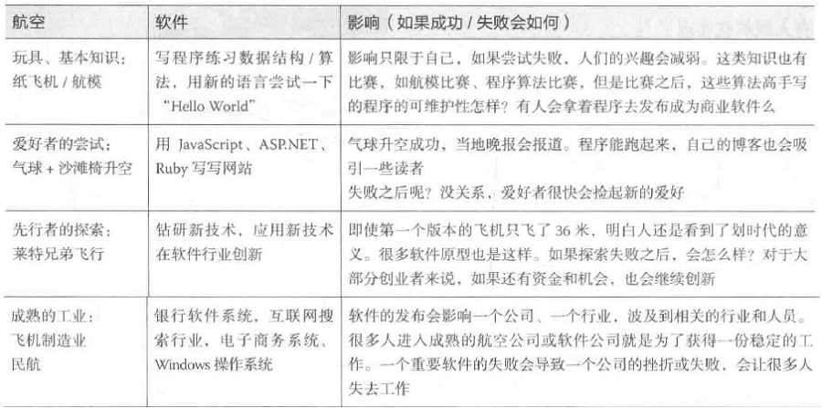
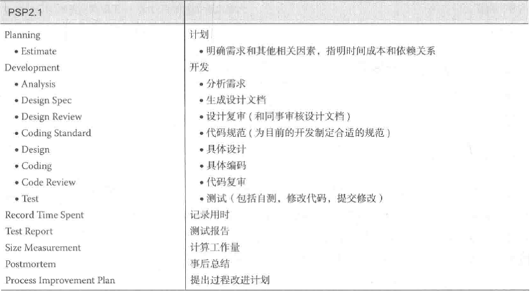
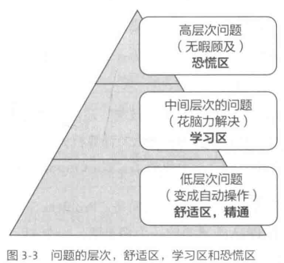
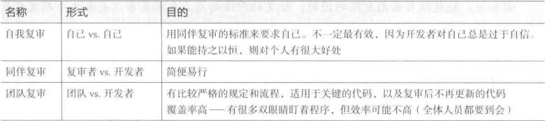
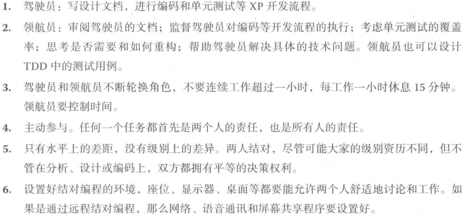
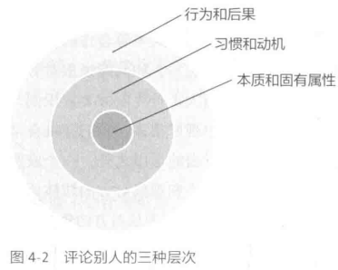

# 构建之法阅读报告

## 第一章　概论

### 1.1 一个推论

​		`软件　＝　程序　＋　软件工程`

​		`软件企业　＝　软件　＋　商业模式`

​		程序（算法和数据结构）是基本功，但是在算法和数据结构之上，软件工程决定了软件的质量；商业模式决定了一个软件企业的成败。软件从业人员和软件企业的道德操守会极大地影响软件用户的利益。

### 1.2 一个类比

​		类比航天产业的发展过程，四个阶段：玩具阶段，业余爱好阶段，探索阶段和成熟的产业阶段。

### 1.3 软件工程是什么

- 软件工程是把系统的、 有序的、 可量化的方法应用到软件的开发、 运营和维护上的过程。
- 软件工程包括下列领域· 软件需求分析、 软件设计、 软件构建、 软件测试和软件维护。
- 软件工程和下列的学科相关· 计算机科学、 计算机工程、 管理学、 数学、 项目管理学、 质量管理、 软件人体工学、 系统工程、 工业设计和用户体验设计。

### 1.4 软件开发过程中的难题

- 复杂性：软件的各个模块之间有各种显性或隐性的依赖关系，随着系统和模块的增多，这些关系的数量往往以几何级数的速度增长；
- 不可见性：软件工程师能直接看见源代码． 但是源代码不是软件本身。 软件以机器码的形式高速 运行 、 还可能在几个CPU核上同时运行， 工程师是 “看” 不到自己的源代码如何具体地在用户的机器上被执行的；
- 易变性：软件看上去很容易修改， 修改软件比修改硬件容易多了 人们自然地期待软件能在下面两种情况下 ”改变": a)让软件做新的事情； b)让软件适应新的硬件。 但是与此同时，正确地修改软件是一什很困难的事；
- 服从性：软件不能独立存在． 它总是要运行在硬件上面． 它要服从系统中其他组成部分的要 求． 它还要服从用户的要求 、 行业系统的要求；
- 非连续性：人们比较容易理解连续的系统： 增加输入 ， 就能乔到相应输出的增加C 但是许多软件系统却没有这样的特性， 有时输入上很小的变化， 会引起输出上极大的变化。

### 1.5 软件工程的目标

​		目标是创造足够好的软件。Bug少，用户满意度高，可靠性强，软件流程质量好，容易维护。具体对软件工程师的要求是：1）能研发出符合用户需求的软件；2）通过一定的软件流程，在预计时间内发布足够好的软件；3）能证明所开发的软件是可以维护和继续发展的。

## 第二章 个人技术和流程

### 2.1 单元测试

开发过程中，团队之间工作有较强的依赖关系，为了保证各模块的质量，需要一定的单元测试。

单元测试应该准确、 快速地保证程序基本模块的正确性。 下面是验证单元测试好坏的一系列标准：

- 单元测试应该在最基本的功能／参数上验证程序的正确性；
- 单元测试必须由最熟悉代码的人（程序的作者）来写；
- 单元测试过后， 机器状态保持不变；
- 单元测试要快（ 一个测试的运行时间是几秒钟， 而不是几分钟）；
- 单元测试应该产生可重复、一致的结果。
- 独立性：单元测试的运行／通过／失败不依赖于别的测试， 可以人为构造数据， 以保持单元测试的独立性。
- 单元测试应该覆盖所有代码路径；
- 单元测试应该集成到自动测试的框架中；
- 单元测试必须和产品代码一起保存和维护。

### 2.2 回归测试

针对bug fix，要做回归测试，目的是：1）验证新的代码的却改正了缺陷；2）同时要验证新的代码有没有破坏模块的现有功能。单元测试是回归测试的基础。

### 2.3 效能分析

为了让自己的程序跑的又快又好，要进行程序性能分析和改进。分析方法有：

- 抽样
- 代码注入

如果我们不经过分析就盲目优化，也许会事倍功半。

### 2.4 个人开发流程

Personal Software Process(PSP)

PSP的目的是记录工程师实现需求的效率。

## 第三章 软件工程师的成长

### 3.1 个人能力的衡量与发展

初级软件工程师的成长历程：１）积累软件开发相关的只是，提升技术技能；２）积累问题领域的知识和经验；３）对通用的软件设计思想和软件工程思想的理解；４）提升职业技能；５）实际成果。

软件开发的工作量和质量的衡量指标：１）项目/任务有多大；２）花了多少时间；３）质量如何；４）是否按时交付。（实际项目中，稳定、一致的交付时间是衡量一个员工能力的重要方面。）

TSP(Team Software Process)对团队成员的要求：１）交流；２）说道做到；３）接受团队赋予的角色并按角色要求工作；４）权利投入到团队的活动；５）按照团队流程的要求工作；６）做好准备工作；７）理性的工作。

### 3.2 软件工程师的思维误区

- 分析麻痹：不要妄图弄清楚所有细节、所有依赖关系后再动手，这样会有无从下手的感觉；
- 不分主次：不经分析，想马上修复所有主要的和次要的依赖问题；
- 过早优化：不要在局部问题上过于纠结花大量时间对其优化；
- 过早泛化：首先需要做的是解决当前特定问题，而不是妄图解决所有类似问题；
- 避免画扇面的情况：踏踏实实干事，停止一味创新的臆想。

### 3.3 软件工程师的职业发展

引用书中一位大佬的话：

>任何事情，当你仔细探究，你就会理解它的量和质；当你对一个领域的神韵足够了解，并开始链接这个领域的表现形式和实现细节的时候，任何一个领域都是会变得隐忍入胜的。

做任何事，从事任何职业都应该保持一颗敬畏之心，端正态度，并付诸实际行动，那么个人的职业前景也会不错的。

知识＋技能

职业知识知识评估：https://www.cnblogs.com/xinz/p/3852177.html

### 3.4 技能的反面

正确把握学习区，踏踏实实，不断前进。

## 第四章 两人合作

### 4.1 代码规范

- 代码风格规范：主要是文字上的规定
- 代码设计规范：涉及程序设计、模块之间的关系、设计模式等方方面面的通用原则；

- 原则：简明易读，无二义性。

### 4.2代码风格规范

缩进；行宽；括号；断行与空白的{};分行；命名；下划线；大小写；注释；(page70-74)

### 4.3代码设计规范

函数；goto；错误处理（参数处理，断言）；如何处理C++中的类(page75-78)

### 4.4 代码复审

代码复审的形式

复审的目的在于：

- 找出代码的错误：编码错误和不符合团队代码规范的地方
- 发现逻辑错误；
- 发现算法错误；
- 发现潜在的粗偶无和回归性错误：当前的修改导致以前修复的缺陷又重新出现；
- 发现可能需要改进的地方；
- 教育，传授经验，共同成长。

###  4.5 结对编程

结对编程可以让我们每时每刻都处在代码复审的状态，一对程序员平等的、互补地进行开发工作。一起工作，一起分析和设计，一起测试，一起编码，一起写文档....

结对编程中因为有随时的复审和交流，程序的质量取决于水平较高的那一位程序员。这样会减少程序中的错误，程序的初始质量会高很多，这样就会省下很多以后修改和测试的时间。

如何结对编程：

两人编程需要磨合，如何给予正确的反馈很重要，我们在工作中需要对同伴的工作进行反馈，表达感谢，阐明要求，指出不足等。

